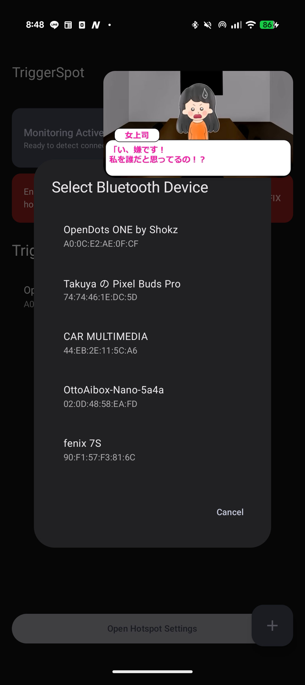
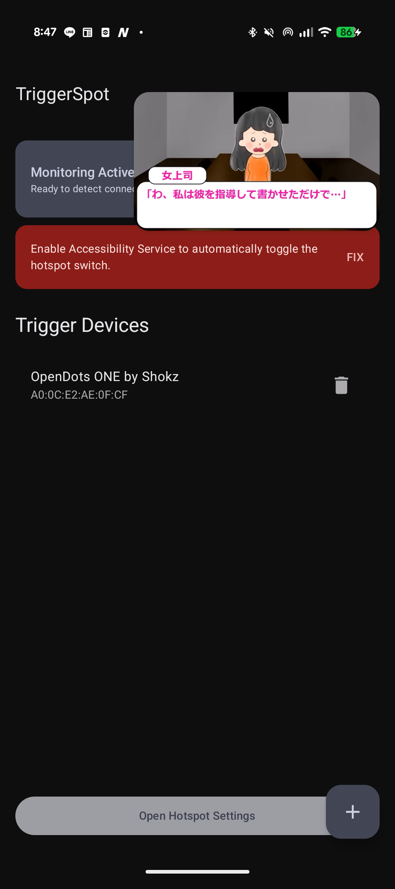

# TriggerSpot

TriggerSpot は、特定の Bluetooth デバイス（車載システム、イヤホンなど）が接続された際に、Wi-Fi テザリング（ホットスポット）を自動的に有効化する Android アプリです。ユーザー補助サービスを活用することで、最新の Android バージョンでも安定した自動操作を実現しています。

## 主な機能

- **テザリングの自動 ON/OFF**: Bluetooth の接続・切断を検知してトリガーを実行。
- **最新 Android 対応**: Android 11〜15 の制限を回避するマルチレイヤーアプローチ。
- **クイック設定パネル連携**: ユーザー補助サービスにより、クイック設定パネルを自動操作して確実な有効化を実現。
- **高精度な状態検知**: 物理ネットワークインターフェースをスキャンし、テザリングの稼働状態を正確に判定。
- **バックグラウンド常駐**: フォアグラウンドサービスとして動作し、常に接続を監視。

## スクリーンショットと操作手順

### 1. デバイスの登録
アプリを起動し、右下の **「+」ボタン** をタップして、トリガーにしたい Bluetooth デバイスを選択します。ペアリング済みのデバイスがリストに表示されます。

### 2. 権限の設定
アプリが正しく動作するために、いくつかの権限が必要です。メイン画面に赤い警告カードが表示されている場合は、**「FIX」** をタップして設定を行ってください。

- **ユーザー補助サービス (Accessibility Service)**: 自動でスイッチを操作するために必須です。「TriggerSpot」を探して ON にしてください。
- **システム設定の書き込み**: システム内部の設定を変更するために必要です。

### 3. 監視の開始
上部の **「Monitoring Active」** スイッチを ON にすると、バックグラウンドでの監視が始まります。この状態で登録したデバイスが接続されると、自動的にテザリングが有効になります。

## 仕組み

1.  **接続検知**: `ACTION_ACL_CONNECTED` ブロードキャストを受信。
2.  **状態確認**: すでにテザリングが ON の場合は何もしません。
3.  **自動実行**: テザリングが OFF の場合、通知パネルを自動展開し、タイルを検索してクリック。
4.  **自動クローズ**: 有効化を確認後、パネルを閉じて元の画面に戻ります。

## 技術スタック

- **UI**: Jetpack Compose (Material 3)
- **アーキテクチャ**: MVVM + StateFlow
- **データ保存**: Jetpack Preferences DataStore
- **自動化**: AccessibilityService API

## 免責事項

本アプリはユーザー補助 API を利用して UI 操作を自動化します。操作対象はクイック設定パネル内のテザリングスイッチのみです。利用規約および各キャリアのネットワークポリシーに従ってご利用ください。
